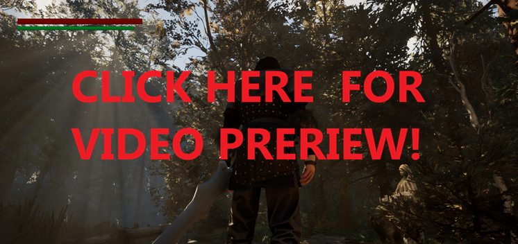
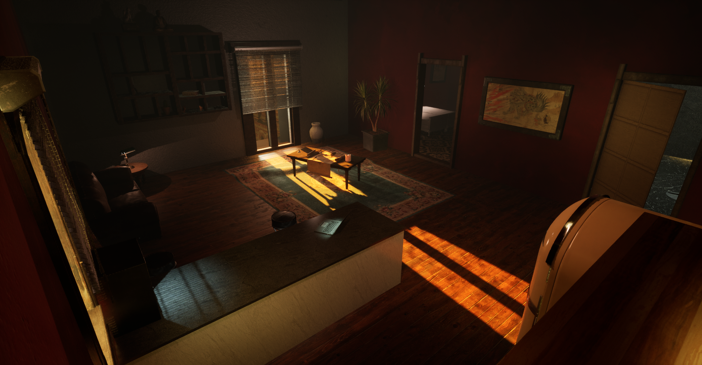
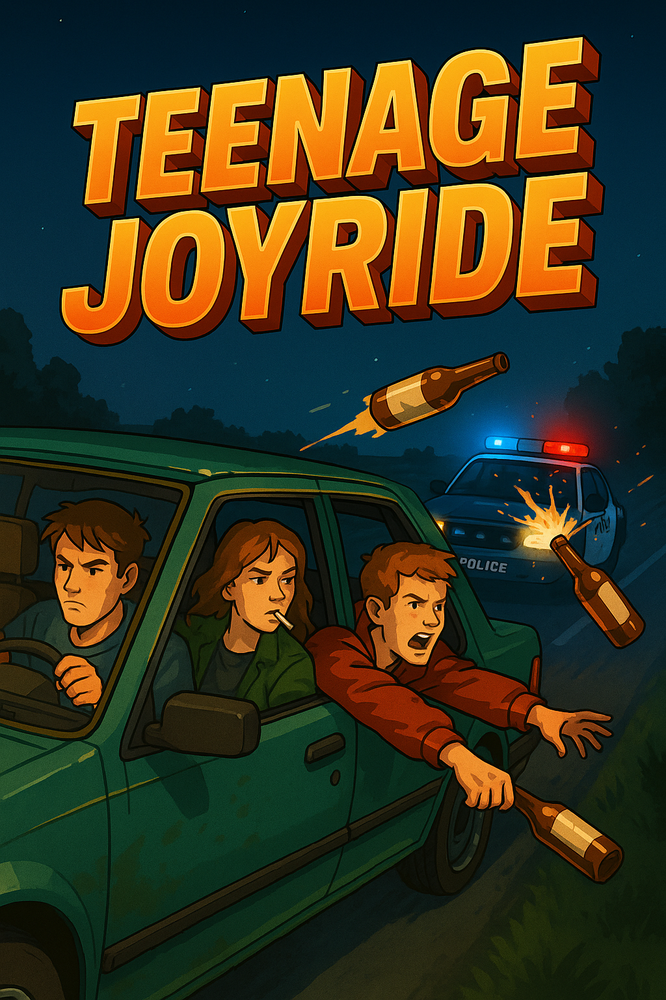

# Hello World!
I am a 31-year old enthusiastic gamer from Finland, currently studying programming and video game development.  
I am learning **C#, C++, UE5, Unity, Python, MySQL** for now.  
Experienced in graphical design, video editing and music composing. I also play piano & guitar.  
Started ICT studies and now I am practicing to use GitHub.  
Here I will be keeping my [DEV-DIARY](https://github.com/donde94/DEV-DIARY) and will be sharing my projects.  

## Projects
- **Toivo** – Souls-like game with Nordic mythology developed in Unreal Engine 5

    
- *(pending)* **Lost Wisdom** - Psychological Horror in first person view. Witness the unraveling of a man’s sanity through his own eyes. - **Unreal Engine 5** - *[Teaser Coming Soon]*
-   

- *(pending)* **Teenage Joyride** - Blasting subwoofers, egging teacher's houses and cruising around with your reckless teenage friendgroup.

  

- [DEV-DIARY](https://github.com/donde94/DEV-DIARY)
- *(pending)* **Sandbox** - Small tests while learning various topics

### Look us up at YouTube!
📫 [YouTube](https://www.youtube.com/@KorentoInteractive)

<!--
**donde94/donde94** is a ✨ _special_ ✨ repository because its `README.md` (this file) appears on your GitHub profile.

Here are some ideas to get you started:

- 🔭 I’m currently working on ...
- 🌱 I’m currently learning ...
- 👯 I’m looking to collaborate on ...
- 🤔 I’m looking for help with ...
- 💬 Ask me about ...
- 📫 How to reach me: ...
- 😄 Pronouns: ...
- ⚡ Fun fact: ...
-->
