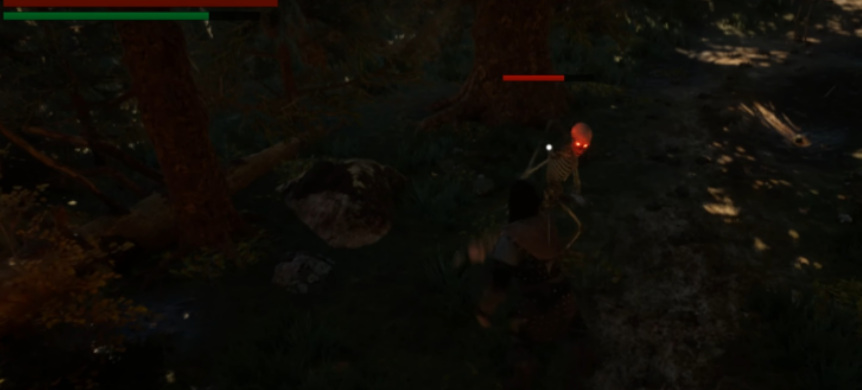

# Hello world!
I am a 31-year old male from Finland, currently studying programming and videogame development.  
I am learning **C#, C++, UE5, Python, MySQL** for now.  
I started ICT studies and now I am practicing to use GitHub.  
Here I will be keeping my DEV-DIARY and will be sharing my projects.  

## Projects
- [DEV-DIARY](https://github.com/donde94/DEV-DIARY)
- *(pending)* **Toivo** - Souls-like game with Nordic mythology - Unreal Engine 5
- *(pending)* **Lost Wisdom** - Psychological Horror Game - Unreal Engine 5
- *(pending)* **Sandbox** - Small tests while learning various topics

### Look us up at YouTube!
📫 [YouTube](https://www.youtube.com/@KorentoInteractive)

<!--
**donde94/donde94** is a ✨ _special_ ✨ repository because its `README.md` (this file) appears on your GitHub profile.

Here are some ideas to get you started:

- 🔭 I’m currently working on ...
- 🌱 I’m currently learning ...
- 👯 I’m looking to collaborate on ...
- 🤔 I’m looking for help with ...
- 💬 Ask me about ...
- 📫 How to reach me: ...
- 😄 Pronouns: ...
- ⚡ Fun fact: ...
-->
